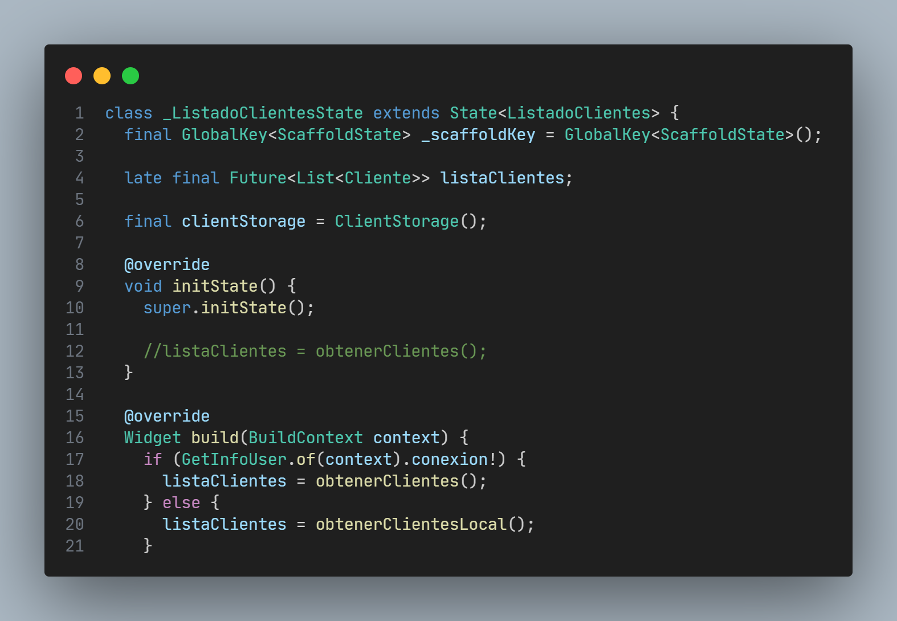

# app_pedidos_8

Un nuevo proyecto de Flutter.

## Empezando

Este proyecto es un punto de partida para una aplicación Flutter.

Algunos recursos para ayudarte a comenzar si este es tu primer proyecto de Flutter:

- [Lab: Write your first Flutter app](https://docs.flutter.dev/get-started/codelab)
- [Cookbook: Useful Flutter samples](https://docs.flutter.dev/cookbook)

Para obtener ayuda para comenzar con el desarrollo de Flutter, consulte la
[online documentation](https://docs.flutter.dev/), que ofrece tutoriales,
ejemplos, orientación sobre desarrollo móvil y una referencia API completa.

## Vista previa de la app_pedidos - Elaborar una aplicación de pedidos - Parte 8

## Código de las pantallas

